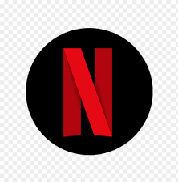

 
  

<h1 align="center"> Netflix Movies and TV Shows Clustering </h1>
<h3 align="center"> AlmaBetter Verfied Project - <a href="https://www.almabetter.com/"> AlmaBetter School </a> </h5>

 

I have clustered similar movies and TV Shows available on Netflix taking into account of attributes like Description, Cast, Director, Genre etc of a particular movie/show.

<h2> :floppy_disk: Project Files Description</h2>

This Project includes 1 ipynb notebook and 1 input CSV file:

<h4>IPython Notebook:</h4>
<ul>
  <li><b>TEAM_REALITY_NETFLIX_MOVIES_AND_TV_SHOWS_CLUSTERING.ipynb</b> - Final IPython Notebook with explanation of steps in markdown.</li>
  
</ul>

<h4>Input Files:</h4>
<ul>
  <li><b>NETFLIX MOVIES AND TV SHOWS CLUSTERING.csv</b> - Input dataset having information about different shows/movies available on Netflix.</li>
  
</ul>

<h2> :book: About the Project</h2>

With the advent of streaming platforms, there’s no doubt that Netflix has become one of the important platforms for streaming. The dataset that we have used for EDA and clustering has been collected by Flixable, a third-party Netflix search engine. There are 12 features and around 7700 observations in the dataset and are mostly textual features.

Through univariate and multivariate analysis, we found trends that will help in understanding what content is being consumed country-wise, depending on some categorical features like rating, type, genres, cast, directors, etc. Clustering was performed along with NLP on textual columns and then a mini-recommendation system was built out of it.

<h2> :book: Project Description</h2>

In our project, Netflix Movies & TV Shows Clustering, we were able to analyse and perform an unsupervised Machine Learning Algorithm for the unlabelled datasets. The dataset we were provided with contains several columns and other numerical features. We were also asked two questions that could be answered from EDA.

The EDA was done extensively as we needed to derive good insights to support our claim and hypothesis. We were able to answer the two questions that followed along with the EDA, country-wise trend analysis on content and genre; and also to analyse if Netflix was focusing more on Shows rather than Movies.

After we performed EDA, both univariate and bivariate analysis, we have prepared our text columns by following basic text cleaning, stopwords removal, tokenisation and stemming. After the text columns were ready, we selected only features or words that were important using TF IDF Vectorisation and also reduced dimension. 

The prepared text columns were clustered after selecting an optimal value from elbow plots. Finally, we used K Means to cluster our dataset into 9 distinct clusters and we were also able to encode or label the dataset accordingly.

Subsets of dataset formed from clustering were analysed and word clouds were plotted, after which we used interactive Plotly visualisation to represent the cluster. 

Finally, a simple recommendation system was also tried out, the future scopes for the projects were also identified. 

<h2> :clipboard: Execution Instruction</h2>

The given IPython Notebook can be either downloaded to be run on your local Jupyter Notebook or can be directly run on Google Colab.

<!-- CREDITS -->
<h2 id="credits"> :scroll: Credits</h2>

 Nadeeha A | Avid Learner | Data Scientist | Machine Learning Engineer | Deep Learning enthusiast

 <i> Contact me for Data Science Project Collaborations</i>

<h2> :books: References</h2>
<ul>
  <li>
realpython.com, 'K-Means Clustering in Python: A Practical Guide'. [Online].

      
Available: https://realpython.com/k-means-clustering-python/

  </li>
  <li>
towardsdatascience.com, 'Content strategy of Netflix in the recent years'. [Online].

      
Available: https://towardsdatascience.com/deciphering-netflixs-content-strategy-through-nlp-b59cd2e84873

  </li>
  
</ul>

